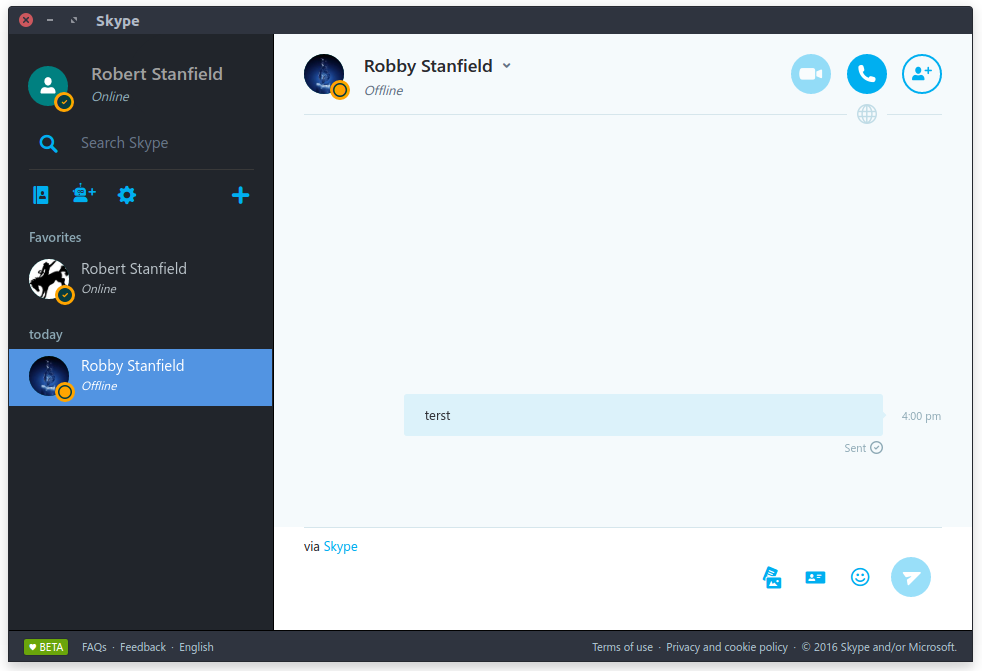

# Ghetto Skype

Ghetto Skype is an electron client that uses Web Skype to better integrate with desktop environments found on Linux.

Credit to [skype-unofficial-client](https://github.com/haskellcamargo/skype-unofficial-client) for coming up with this idea. His version uses node webkit whereas mine uses Electron. This means you get a few extra goodies like notifications from Electron.



## Why it's better than Web Skype
- Tray Icon indicates you have unread messages
- Electron will send notifications to notifyd
- Use your default image viewer (writes to /tmp)
- Start minimized when you start your computer
- Run Skype through a proxy
- Alternative themes

### Cons
- I haven't figured out how to get video calls to work yet

## Installing

You can download the RPM or DEB package on the [releases page](https://github.com/stanfieldr/ghetto-skype/releases)
or you can build from source with the instructions below.

If you run Arch Linux, you can use the [AUR package](https://aur.archlinux.org/packages/ghetto-skype) [nlowe](https://github.com/nlowe)
created. Please send any issues with the AUR package to [his repository](https://github.com/nlowe/aur-ghetto-skype/issues).

#### Dependencies

You need a newer version of node/npm installed. If you already have node installed, please check that you are using version 6.3.1 or higher. If you have an older version installed or need to install it, I recommend installing [nvm](https://github.com/creationix/nvm) so you are not dependent on your distros version of node as it may be too old. If you are installing node via Debian based distro, please make sure you install the nodejs-legacy package.

```bash
# To build a RPM you need this:
$ sudo dnf install rpm-build

# To build a DEB you need this:
$ sudo apt-get install fakeroot dpkg icnsutils graphicsmagick xz-utils build-essential

```

#### Try it out

Skip packaging and run this:
```bash
[u@h ghetto-skype]$ npm install && npm start
```

#### Setup

We use electron-builder to package Ghetto Skype. Change the target to the
format you prefer. By default, it uses "deb". For a full list of supported formats,
refer to the [wiki](https://github.com/electron-userland/electron-builder/wiki/Options#buildlinux) for electron-builder.
The target should be set in `ghetto-skype/package.json`

```bash
[u@h ghetto-skype]$ npm run dist
[u@h ghetto-skype]$ cd dist && ls # package placed here
```

## Tips

There's a separate settings window located in the context menu of the tray icon.

## Using a Proxy

There currently isn't a way to edit this with the settings window right now. You can open `~/.config/Ghetto\ Skype/settings.json` with your favorite text editor and add your proxy to the ProxyRule setting, save, and restart
Ghetto Skype. For a better understanding of the format please refer to Electron's [wiki](https://github.com/electron/electron/blob/master/docs/api/session.md#instance-methods) (specifically ses.setProxy)

Example:
```bash
{
	"StartMinimized": false,
	"MicrosoftAccount": false,
	"NativeImageViewer": false,
	"ProxyRules": "socks5://46.105.6.191:5050"
}
```

## Setting Zoom Level

If the font/photos are not big enough for you, you can use the zoom factor in the `~/.config/Ghetto\ Skype/settings.json`.
This will be added to the settings screen soon.

Example 150%:
```bash
{
	"StartMinimized": false,
	"MicrosoftAccount": false,
	"NativeImageViewer": false,
	"ProxyRules": "socks5://46.105.6.191:5050",
	"ZoomFactor": 1.5
}
```

## Disclaimer
The Skype name, associated trade marks and logos and the "S" logo are trade marks of Skype or related entities. This project is merely a browser :)
